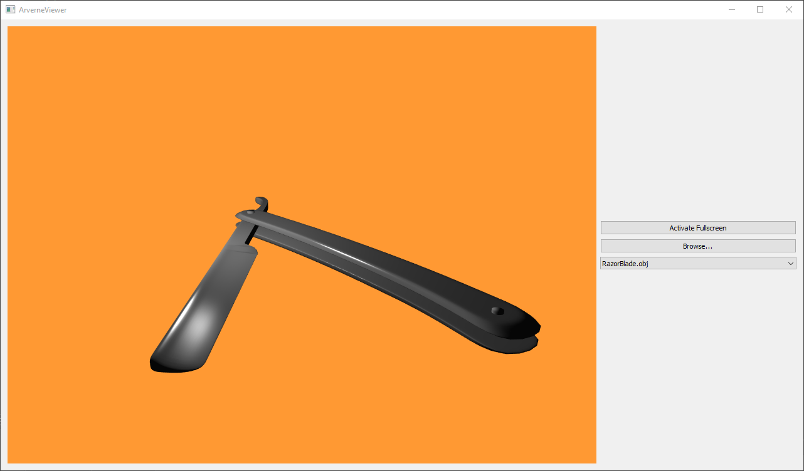

# Arverne Viewer
 


---

<b><u>Arverne Viewer</u></b> is a vulkan implementation of a PBR material viewer, interfaced with Qt

The project aims at terms to :
- Load dynamically at runtime 3D model file (.obj, .fbx, ...)
- Load also dynamically textures designed for materials channels. (Height, albedo, ...)
- Render the loaded model in real time, using physically based rendering and image based lighting.
- Edit your scenes and enjoy the view :D 

At the moment the project is far from being finished.

## Functionalities :
- .obj files loading.
- Model Selection
- Phong Illumination
- ArcBall Camera

---
## Prerequisite 

You have to know that the project is not compatible with Linux distributions for now and is supported only on windows OS. 

If you want to compil the code you must have :
- CMake version 3.10 minimum installed 
- The Vulkan sdk installed
- The VULKAN_SDK environment variable set to the installation folder of the vulkan SDK
- Qt version 5.10 at least, installed on your system

---

## Install :

Whole install instructions :

```
git clone https://github.com/Rodousse/Arvern-Viewer.git
cd Arvern-Viewer
git submodule update --init
mkdir build
cd build
cmake ..
```

You will have to set the Qt5Widgets directory path (path/to/Qt/5.x.x/yourCompiler/lib/cmake/Qt5Widgets) with cmake-gui or as argument with the cmake command.

## Vulkan with Qt :

You'll have to enable the vulkan feature if it's not already made. If you installed the LunarG SDK after Qt, Qt is not configured to build vulkan applications. A part of Qt has to be recompile if you want to compile the project. You must use the configure tool of Qt with the argument "*-feature-vulkan*". You can find the documentation of the configure tool here :

https://doc.qt.io/qt-5/configure-options.html

--- 
## Dependency

This project uses different dependencies :

- [TinyObjLoader](https://github.com/syoyo/tinyobjloader.git) : Used to load obj files to render (Credit to [syoyo](https://github.com/syoyo))
- [Eigen](https://github.com/eigenteam/eigen-git-mirror) : Matrice and vector manipulation

---
